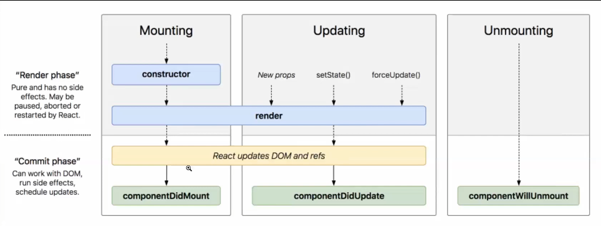
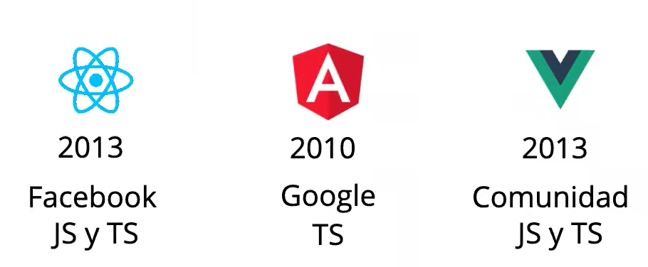

# 1. Que es SPA
* Una `SPA(Sigle Page Aplication)` es una forma de desarrollo web en el que la pagina web esta contenida en un solo documento HTML.
* Mientras se navegan en el navegador se  cargan los archivos solicitados por el servidor.
* De esta manera se mejora el rendimiento(performance) tiempos de respuesta y mejora la experiencia de usuario
* Se realiazan la gestion de rutas para la navegacion en el "navegador".
* La gestiones de `rutas` se parecen mucho a `Angular` u otro poryecto de SPA.
* 
# 2. Que es React.js
* **Def**: Esta es una `Libreria` de `Js` para crear `interfaces de usuario`.
* Es una solucino muy ligera que se puedenaplicar a una pagina web.
* Utiliza como lenguaje nativo `Javascript`.

* En conclusion es una `libreria` de js que nos permite crear aplicaciones `SPA` de manera facil y rapida flexible y de muy alto escalabilidad.
* Fue creada por `Meta` en 2013, el cula lo mantine actualmente.
* Es de codigo abierto, lo que implica que existen muchas comunidades que aportan informacion ayuda a esta libreria.
1. Ventajas: 
* `Velocidad`: Tiene un motor de renderizado potente en el desarrollo.
    * DOM Virtual: Esta es la base de la velocidad de React.js, este es un sistema de actualizacion potente y rapido que nos ofrece el renderizado especialmente rapido.
* `Componentes`: Las  filosofia de React.js esta basado en componentes web, los cuales nos permiten reutilizar el codigo.
    * Son componentes mucho mas pequenios y mas especificos que se pueden anidar
    * Cada componete devuelve un unico elemento  `html`.
    * Pueden ser reutilizables y pueden contener a otros componentes.
    * Los componentes pueden ser convertidos en componentes mas especificos(pequenios)
    * Se aplica el concepto de `modularizacion` a este enfoque
    * Existe componententes sin `estado` o `staless-puros` que solo se encargan de realizar un solo tipo de accion.
    * Componentes `containers`, estos son los encargados de realiar la logica de del componente en si.
    * Se pueden realiza la comunicacion de  componentes mediante las `props`.
    * 
* `Desarrallo Declarativo`: Se realizan mediante funciones `puras`.
    * Es de paragidma de programacion `declarativo`
    * Es decir cada componete nos va a devolver un componente nuevo.
    * Trabaja sobre las variaable globales en las que se realizan la actualizacion en aquellos estados  que son modificados o actualizados.
    * 
* `Anidacion de Componentes`: Se pueden realizar la anidacion de componentes en esta libreria. Donde se pueden simplificar enormente hasta llegar a la definicion del componente.
    * Se pueden realizar la anidacion de componentes en orden superios y orden inferior
    * Los `eventos` se comunican de `abajo` hacia `arriba`.
    * Las `props`/datos se comunican de `arriba` hacia `abajo` o de orden 
    superior a orden inferior.
    * La comunicacion entre los componentes es  `unidireccional`.
    * Los componentes estan escritos en `jsx`.
* `Isomorfismo`:
    * Es tambine conocido como `Javascript Univesal`, capacidad con la que podemos renderizar tanto en `servido-api` o en  `cliente`
    * Esto puede mejorar el `SEO` y el posicionamiento de la aplicacion.

* `Agilidad de Desarrollo`: Se puede usar la herramienta `create-react-app`.
    * React.js disponde de todas las librerias que se encuentran en `JQuery`
    * Estos dos tecnologias pueden convivir pero no es necesario usar este ultimo en nuestros proyectos
### Aplicaciones moviles con React
1. `Ionic`
2. `React Native`.

## 1. Pasos de la instalacion de REACT.js
### 1.1 Perfil de Desarrollo `Dev`
1. Se va a realizar la instalacino Node.js como en todos los paquetes para desarollo con Node.jsj
2. Se usa el script `npx create-react-app`, el cual nos permite crear una plantilla ya hecha con tood lo necesario para arrancar rapidamente con `React.js`. 

3. Ejecuta comando para instalar "`npm i --save -g create-react-app`" herramienta a nivel global en el proyecto.
4. Se puede usar `npx`, el cual es com un `CDN` que nos permite emplear los paquetes de React pero no de manera `global`.
5. Ejecutar el comando `npm start` para empezar la aplicacion de react.js
    - Esto nos permite ejecutar la aplicacion en el puerto 3000, que `despliega` un build de desarrollo y inicia en nuestro serviodor local ho `localhost`.
    - Se puede usar el comando `npm run build` pare desplegar el `build de produccion` el cual sera cargado en cualquier servidor de la nube.

### Usos: 
* react: libreria de react ensi
* react-dom: herramienta para el renderiado del DOM html
* react-scripts: herramienta para crear scripts para automatizar el proceso de creacion de la aplicacion.
* Link del npm: https://www.npmjs.org/


## 2. Componentes
* Los componentes son reutilizables y se pueden contener otros componentes anidados
* `Componente Puros`: Son componentes sencillos y que no cuenten con mucha logica o complejidad, para ello se usan las `props` que son datos que se pasan de `padres` a `hijos`.
### 2.1 Componentes de Clase
* Son componentes que extienden del Objecto `Component` de react
* Cuentan con un metodo render()
* Esto es una forma de embeder codigo `html` dentro de `js`. Donde le el codigo es `jsx` finalmente.
* Estos tipos de componentes tienen sus propios constructores tal como es la OOP
* `Las props` son datos que se le pasen de padres a hijos para indicarle que es lo que se va a `renderizar` o pintar
    * Pueden ser de cualquier tipo de dato, ya se funciones, string, objtos, etc.
* `Las Component.propTypes={}`: nos van a permitir especificar que tipo de datos son las `prop` que se  esta pasando, asi como realizar ciertas validaciones y contrains para las props.
* Este componete es como se trabajaba tradicionalmente con React.js antiguamente
* Tiene funciones y propiedades privadas.

* Un cambio en el estado del componete, `implica` un nuevo renderizado del componente en el DOM virtual o en la `vista en este caso` (ojo: El cambio en el estado genera un nuevo renderizado del componente)`.
```jsx
import React, { Component } from "react";
import PropTypes from "prop-types";

class Greeting extends Component {
  constructor(props) {
    super(props);
    // estado de la aplicacion.
    this.state = {
      age: 24,
      count: 0,
    };
  }

  render() {
    return (
      <div style={{ color: "#f38233", fontWeight: "500" }}>
        <h3 className="name">My nombre es: {this.props.name}</h3>
        <div className="greeting">
          Hola como estan todos por esta zona de los developers.
        </div>
        <div>Tengo {this.state.age} anios de edad</div>
        <button
          onClick={() => {
            this.setState({
                count: this.state.count + 1,
            })
          }}
        >
          Increment
        </button>
        <label htmlFor="">{this.state.count}</label>
        <button
            onClick={() => {
                this.setState((prevState, nextState) => ({
                    count: prevState.count - 1,
                }))
            }}
         >
          Decrement
        </button>
      </div>
    );
  }

  // metodo functinal
  birthDay = () => {
    this.setState((prevState) =>({
        age: prevState.age + 5
    }))
  
  }
}

Greeting.propTypes = {
  name: PropTypes.string.isRequired,
};

export default Greeting;

```

## 2.2 Componentes tipo Contendor
* Estos  son lso componentes que tienen la logica
* Estos son componentes de `orden superior`; es decir que estos componente pueden renderizar otros componentes.
* `Estos se encargan de la logica en si`.
## 2.3 Componentes puros
* Estos son lso componentes los cuales solo tienen la funcion de renderizar los elementos `html`, no se ocupan de la logica de aplicaion en si, solo de renederizarlos.
* Los componentes de este tipo van a recibir los datos en forma de `props` los cuales van a ser pintados
* `Props`: PUeden ser datos primitivos o datos complejos(Listas, clases etc.)
## 2.4 Hooks
## 2.5 Routes
## 2.6 Pages(views)
* Estos contienen las vistas  que se van a renderizar en el DOM o que el usuario final los va a aprciar.
  * `auth`: Login, procesos de autenticacion, logeo etc
  * `home`
  * `404`
  * Estas son carpetas que se van a renderizar como la vista de la aplciacion.

## 2.7 Models
* Estos son los modelos de la aplicacion `clases, objetos`.


## Embede JS en HTML
## Renderizados codicionales
## Nota importante: 

`Cuando se realiza un cambio en le estado de la apiccion se realiza un "rerenderizado" de este componente; es decir de esta manera se puede apreciar la **reactividad** en accion`.

### 2.8 Componentes Funcionales
* Un componente funcinal es una functin de `orden superior` o de `orden superior`, que en cualquier momento pueden devolver elementos `htmls`.
* En este caso es una funcion, ya no se implementa una clase.
* Facil de crear componentes funcionales y extremadamente facil de usarlos en los componetes.
* Es una funcion que es facil de embeder sin la necesida de crear clases 
```jsx
import React, { useState } from "react";
import PropTypes from "prop-types";

// se puede colocar:(props) => {} o aplicando el destructuring
const GreetingFunctional = ({ name }) => {
  const [state, setState] = useState({
    age: 23,
    count: 0,
  });


  const birthDay = () => {
    setState({ count: state.count = 23})
  };
  
  return (
    <div style={{ color: "#f38233", fontWeight: "500" }}>
      <h3 className="name">My nombre es: {name}</h3>
      <div className="greeting">
        Hola como estan todos por esta zona de los developers.
      </div>
      <div>Tengo {state.age} anios de edad</div>
      <button
        onClick={() => {
            setState({ count: state.count + 1 });
        }}
      >
        Increment
      </button>
      <label htmlFor="">{state.count}</label>
      <button
        onClick={() => {
            setState({ count: state.count - 1 });
        }}
      >
        Decrement
      </button>
    </div>
  );

  
};

GreetingFunctional.propTypes = {
  name: PropTypes.string.isRequired,
};

export default GreetingFunctional;

```

### 2.9 Componentes Stateless
* Estos componentes `no tinen estado` en su implementación.


# 3. Hooks en React
## 3.0 Configuraicones preliminares en VSC
* `.editorconfig`: Este es un archivo de configuracion de como queremos o como se va a desarrollar en nuestro entorno de desarrollo.
```txt
ident_style = tab
end_of_line = lf -> dependiendo si es mac o windows no hayproblemas en el versionado de git
insert_final_newline = true
tab_width = 2 -> tamanio del los tabuladores
charset = utf-8 -> codificacion de caracteres utf-i
trim_trailing_whitespace = true -> es para que si dejamos un espacion en cada final de linea nos los configura automaticamente
```

* Son `funciones` que se incorporaron alla por los anios 2018, que hacen es simplificar o especificar mecanismos para trabajar con componentes `funcionales`, mientras que en las clases son mas complicados implementar componentes, los hooks son caminos para implementar mas facilmente en los con la ayuda de `componentes funcionales`.
## 3.1 useState()
* Todos los `hooks` de react comienzan con `use...`
* Son funciones de que se emplean con componentes `funcionales` que nos van a permitir trabjar,acceder y realizar operaciones con el `estado privdao` del componente.

## 3.2 useRef()
* Esto es util para identificar elementos y referenciarlos estos elemento dentro de la vista.
* Esto es similar a lo que usaba el `jquery ` para asociar identificador y extraer el id de este.
* Con esto es util para saber el contenido de un elemento HTML.
* `Esto es lo mas parecido a como `js` manipula los atributos del HMTL`
## 3.3 useEffect()
* Controla los cambios en la vista y controla  el ciclo de vida del componente
* Cada vez que hay `cambio  en el componete` se ejecuta el codigo que esta dentro la definicon de useEffect().
* Sol se puede tener un solo `useEffect()`
* Si hay mas de uno el ultimo es el qu se toma en cuenta.

```jsx
    const Ejemplo2 = () => {
      // sintaxis

      const [contador1, setContador1] = useState(0);
      const [contador2, setContador2] = useState(2);

      /**
      * Creamos una referencia con useRef() para asociar
      * una `variable` con un elemento del  DOM del componente (vista HTML).
      */

      const ref = useRef();

      useEffect(() => {
        console.log(" CAMBIO EN EL ESTADO DEL COMPONETE: OJO `ESTAO`");
        console.log("Mostrando Referencia a elemento del DOM");
        console.log(ref); // esto contine una referencia aun elemento del DOM(HTML)
      });
      return (
        <div>
          <h1>*** Ejemplos : useState(), useRef(), useEffect() ***</h1>
          <h2>Contador 1: {contador1}</h2>
          <h2>Contador 2: {contador2}</h2>
          {/* Elemento referenciado va a ser el <h4> */}
          <h3 ref={ref}>Ejemplo de elemento referenciado</h3>
          <button onClick={() => setContador1(contador1 + 1)}>Incrementar</button>
          <button onClick={() => setContador1(contador1 - 1)}>Decrementar</button>
          <button>Mostrar ref</button>
        </div>
      );
    };

    export default Ejemplo2;
```
## 3.4 useContext()
* Esto es util para utilizar los datos o el contexto de datos para utilizar el contexto para pode pasarlo a los componentes inferiores.
* Lo que nos facilita es pasar a traves de los componentes `datos` en ves de hacerlo con `props` sino con `useContext`.
* Estos pueden ser como estados `locales` del componete  sin pensarlo tan explicitamente con `redux.js`.


# 4. Life Cicle Methods
# Mounting.
* Los metodods de vida de los componentes en React.js son aquellas funciones que se encargan de controlar y gestionar `como y cuando` se renderizan estos  componentes en el `DOM`.




## 4.1 ComponenteDidMount()
* Este es un metodo de vida del componente que se encarga de ejecutar el codigo cuando se `monta` el componente pero `antes` de que se actualice en el `HTML`.

# Updating
## 4.2 componenteDidUpdate()
* Cuando sufre un `cambio` en el `estado` o cuando recibe `props` o cuando se ejecuta una funcion `forceUpdate()` que fuerza la actualizacion de la vista.
* Cuando hay nuevas `props`  se modifican el las props antiguas implica un renderizacion de la vista.
* Cuando se usa el `metodo` especial `setState()`, se actualiza el estado del componete el cual repercute en la actualización del `DOM` de la vista.
* Se puede forzar la actualizacion con el metodo `forceUpdate()`
* Todas estas actualizaciones se realizan sobre el `montaje inicial`, por lo tanto el render necesita una nueva actualizacion
* ojo el cula es controloado por el metodo `componentDidUpdate()`.
# Unmounting
## 4.3 componentWillUnmount()
* Cuando se quita o cuando se oculta en el `html` los componentes en el `dom` o la vista.
* Codigo que se ejecuta `antes` de que se quite o oculte el componente de la vista.


```jsx 


    import React, { Component } from 'react';

    class LifeCycle extends Component {

        
        constructor(props){
            super(props);
            console.log("Instancing the class");
        }

        componentWillMount() {
            // WILLMOUNT:  Antes de que se monnte el componente.
        }
        componentDidMount() {
            // DIDMOUNT: Justo acabar el montaje del componente 
            // pero antes de pintarlo o `renderizarlo` en la vista

        }

        componentWillReceiveProps() {
            // WILLRECIBEPROPS: Cuando vaya a recibir `props`. por part del padre
        }

        shouldComponentUpdate(nextProps, nextState) {
            /**
            * Controla si el componente debe o no actualizarse.
            * Se escoje o no actualizar la vista en determinados casos
            * Si el valor no ha cambiado se escoje actualizar o no la vista en determinado casos
            */
            return false;
        }
        componentWillUpdate(nextProps, nextState) {
            // WILLUPDATE: Justo antes de actualizarse, cuando se ha actualizado

        }   

        componentDidUpdate(nextProps, nextProps) {
            // DIDUPDATE: Justo despues de actualizarse en la vista del html.
        }
        componentWillUnmount() { 
            // WILLUNMOUNT: Justo antes de desaparecer en la `vista` del `html`.

        }

        render() {
            return (
                <div>
                    
                </div>
            );
        }
    }

    export default LifeCycle;
```

###  NOTA: Para usar los metodos de ciclo de vida en componentes funcionales se deben `bindear` lo metodos para evitar errores.

### NOTA: Cuando se usa los hooks para los metodos de vida del componete, al colocar un solo `[]` indica que se ejecuta `una sola vez`, mientras implementarlos sin `[]` esto quiere decir que se ejecuta todas la veces.
# Notas
* Se puede embeder codigo `js` dentro de codigo `html` con `{}` dentro de las llaves.
* 


## Componente de Clase
```jsx
  export class DidMount extends Component {

      componentDidMount() {
          console.log("Comportamiento antes de que el componente sea aniadido al DOM(renderice)");

      }
      render() {
          return (
              <div>
                  <h1>*** componentDidMount() ***</h1>
              </div>
          );
      }
  }
```
## Componete Funcional
```jsx
  export const DidMount = () => {

      useEffect(() => {
          console.log(
                    "Comportamiento antes de que el componente sea aniadido al DOM(renderice)"
                  );
      });
      return (
          <div>
              
          </div>
      );
  }
```
# 5. Estilos en React.js
## 5.1 SCSS y sass (preprocesadores de estilos en CSS)
* Esto nos va a permitir trabajar tanto con `SCSS` o `SASS`
* `Especificidad`: Podemos definir la especifidad a la hora de aplicar estilos a los elementos de forma mas precisa.
* Evitar el `!important` en los estilos

`Instalacion de preprocesadores de estilos`
```bash
npm install --save node-sass
```
* La `herencia` es importante en los estilos
* El `index.css`es el root o en indice de estilos de CSS.
* Los estilos son `heredados` y cargados en cada componente.

## 5.2 Bootstrap
`instalacion` 
```bash
  npm install --save-dev bootstrap
```
* Tenemos que ir al indece `js` de nuestro proyecto e importar `bootstrap` para que nuestro proyecto pueda usarlo.
## 5.3 Bootstrap Icons
* Iconos de la libreria de bootstrap

```bash
  npm i bootstrap-icons --save
```
* Es necesario implementar `funciones` para controlar mas eficientemente los elementos de los componentes.

# 6. Eventos en React.js
* Los componentes desencadenan eventos los cuales pueden implementar para establecer una comunicacion entre componente de orden inferior  y  superior
* Generalmente el hijo es quien `despacha el evento` y el padre es el quien controla la `ejecucion del evento`.
## 6.1 Gestion de Eventos
* `onFocus`:
* `onBlur`:
* `onChange`:
* `onMouseOver`:
* `onMouseOut`:
* `onCopy`
## 6.2 useRef
* Este hook nos permite referenciar objetos `html` en react.js
* Gracias a este hook podemos 

## Extensiones importantes
1. Color highlighting
2. Debbuger for firefox
3. ES7 React/Redux/GraphQL/React-Native snippets.
4. ESLintO(cotrola las reglas y com se debe programas con ES6 en js)-> marcar un estandar de programacion a lahora de desarrollar.

5. Firebase
6. Image preview
7. Jest
8. Jest Runner Test
9. Js Jsx Snippets
10. Material Icon Theme
11. Path Intellisense
12. Version Lens
13. Live shere(pair program)
14. 
14. 
### Comparativas


