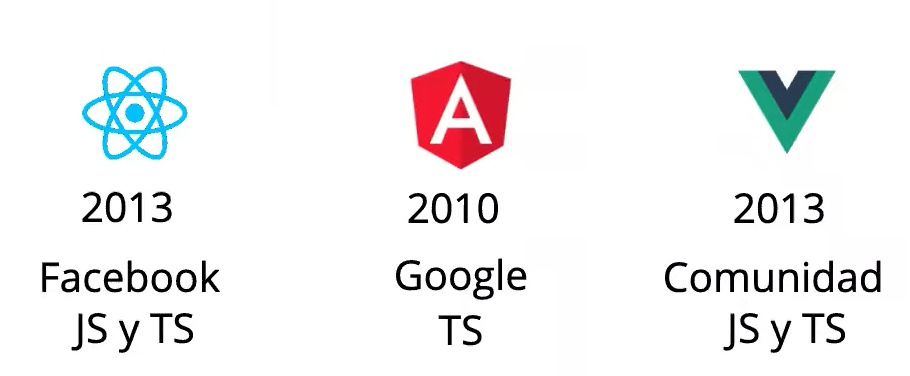

# 1. Que es SPA
* Una `SPA(Sigle Page Aplication)` es una forma de desarrollo web en el que la pagina web esta contenida en un solo documento HTML.
* Mientras se navegan en el navegador se  cargan los archivos solicitados por el servidor.
* De esta manera se mejora el rendimiento(performance) tiempos de respuesta y mejora la experiencia de usuario
* Se realiazan la gestion de rutas para la navegacion en el "navegador".
* La gestiones de `rutas` se parecen mucho a `Angular` u otro poryecto de SPA.
* 
# 2. Que es React.js
* **Def**: Esta es una `Libreria` de `Js` para crear `interfaces de usuario`.
* Es una solucino muy ligera que se puedenaplicar a una pagina web.
* Utiliza como lenguaje nativo `Javascript`.

* En conclusion es una `libreria` de js que nos permite crear aplicaciones `SPA` de manera facil y rapida flexible y de muy alto escalabilidad.
* Fue creada por `Meta` en 2013, el cula lo mantine actualmente.
* Es de codigo abierto, lo que implica que existen muchas comunidades que aportan informacion ayuda a esta libreria.
1. Ventajas: 
* `Velocidad`: Tiene un motor de renderizado potente en el desarrollo.
    * DOM Virtual: Esta es la base de la velocidad de React.js, este es un sistema de actualizacion potente y rapido que nos ofrece el renderizado especialmente rapido.
* `Componentes`: Las  filosofia de React.js esta basado en componentes web, los cuales nos permiten reutilizar el codigo.
    * Son componentes mucho mas pequenios y mas especificos que se pueden anidar
    * Cada componete devuelve un unico elemento  `html`.
    * Pueden ser reutilizables y pueden contener a otros componentes.
    * Los componentes pueden ser convertidos en componentes mas especificos(pequenios)
    * Se aplica el concepto de `modularizacion` a este enfoque
    * Existe componententes sin `estado` o `staless-puros` que solo se encargan de realizar un solo tipo de accion.
    * Componentes `containers`, estos son los encargados de realiar la logica de del componente en si.
    * Se pueden realiza la comunicacion de  componentes mediante las `props`.
    * 
* `Desarrallo Declarativo`: Se realizan mediante funciones `puras`.
    * Es de paragidma de programacion `declarativo`
    * Es decir cada componete nos va a devolver un componente nuevo.
    * Trabaja sobre las variaable globales en las que se realizan la actualizacion en aquellos estados  que son modificados o actualizados.
    * 
* `Anidacion de Componentes`: Se pueden realizar la anidacion de componentes en esta libreria. Donde se pueden simplificar enormente hasta llegar a la definicion del componente.
    * Se pueden realizar la anidacion de componentes en orden superios y orden inferior
    * Los `eventos` se comunican de `abajo` hacia `arriba`.
    * Las `props`/datos se comunican de `arriba` hacia `abajo` o de orden 
    superior a orden inferior.
    * La comunicacion entre los componentes es  `unidireccional`.
    * Los componentes estan escritos en `jsx`.
* `Isomorfismo`:
    * Es tambine conocido como `Javascript Univesal`, capacidad con la que podemos renderizar tanto en `servido-api` o en  `cliente`
    * Esto puede mejorar el `SEO` y el posicionamiento de la aplicacion.

* `Agilidad de Desarrollo`: Se puede usar la herramienta `create-react-app`.
    * React.js disponde de todas las librerias que se encuentran en `JQuery`
    * Estos dos tecnologias pueden convivir pero no es necesario usar este ultimo en nuestros proyectos
### Aplicaciones moviles con React
1. `Ionic`
2. `React Native`.

## 1. Pasos de la instalacion de REACT.js
### 1.1 Perfil de Desarrollo `Dev`
1. Se va a realizar la instalacino Node.js como en todos los paquetes para desarollo con Node.jsj
2. Se usa el script `npx create-react-app`, el cual nos permite crear una plantilla ya hecha con tood lo necesario para arrancar rapidamente con `React.js`. 

3. Ejecuta comando para instalar "`npm i --save -g create-react-app`" herramienta a nivel global en el proyecto.
4. Se puede usar `npx`, el cual es com un `CDN` que nos permite emplear los paquetes de React pero no de manera `global`.
5. Ejecutar el comando `npm start` para empezar la aplicacion de react.js
    - Esto nos permite ejecutar la aplicacion en el puerto 3000, que `despliega` un build de desarrollo y inicia en nuestro serviodor local ho `localhost`.
    - Se puede usar el comando `npm run build` pare desplegar el `build de produccion` el cual sera cargado en cualquier servidor de la nube.

### Usos: 
* react: libreria de react ensi
* react-dom: herramienta para el renderiado del DOM html
* react-scripts: herramienta para crear scripts para automatizar el proceso de creacion de la aplicacion.
* Link del npm: https://www.npmjs.org/


## 2. Componentes
* Los componentes son reutilizables y se pueden contener otros componentes anidados
* `Componente Puros`: Son componentes sencillos y que no cuenten con mucha logica o complejidad, para ello se usan las `props` que son datos que se pasan de `padres` a `hijos`.
### 2.1 Componentes de Clase
* Son componentes que extienden del Objecto `Component` de react
* Cuentan con un metodo render()
* Esto es una forma de embeder codigo `html` dentro de `js`. Donde le el codigo es `jsx` finalmente.
* Estos tipos de componentes tienen sus propios constructores tal como es la OOP
* `Las props` son datos que se le pasen de padres a hijos para indicarle que es lo que se va a `renderizar` o pintar
    * Pueden ser de cualquier tipo de dato, ya se funciones, string, objtos, etc.
* `Las Component.propTypes={}`: nos van a permitir especificar que tipo de datos son las `prop` que se  esta pasando, asi como realizar ciertas validaciones y contrains para las props.
* Este componete es como se trabajaba tradicionalmente con React.js antiguamente
* Tiene funciones y propiedades privadas.

* Un cambio en el estado del componete, `implica` un nuevo renderizado del componente en el DOM virtual o en la `vista en este caso` (ojo: El cambio en el estado genera un nuevo renderizado del componente)`.
```jsx
import React, { Component } from "react";
import PropTypes from "prop-types";

class Greeting extends Component {
  constructor(props) {
    super(props);
    // estado de la aplicacion.
    this.state = {
      age: 24,
      count: 0,
    };
  }

  render() {
    return (
      <div style={{ color: "#f38233", fontWeight: "500" }}>
        <h3 className="name">My nombre es: {this.props.name}</h3>
        <div className="greeting">
          Hola como estan todos por esta zona de los developers.
        </div>
        <div>Tengo {this.state.age} anios de edad</div>
        <button
          onClick={() => {
            this.setState({
                count: this.state.count + 1,
            })
          }}
        >
          Increment
        </button>
        <label htmlFor="">{this.state.count}</label>
        <button
            onClick={() => {
                this.setState((prevState, nextState) => ({
                    count: prevState.count - 1,
                }))
            }}
         >
          Decrement
        </button>
      </div>
    );
  }

  // metodo functinal
  birthDay = () => {
    this.setState((prevState) =>({
        age: prevState.age + 5
    }))
  
  }
}

Greeting.propTypes = {
  name: PropTypes.string.isRequired,
};

export default Greeting;

```
## Nota importante: 

`Cuando se realiza un cambio en le estado de la apiccion se realiza un "rerenderizado" de este componente; es decir de esta manera se puede apreciar la **reactividad** en accion`.

### 2.2 Componentes Funcionales
* Un componente funcinal es una functin de `orden superior` o de `orden superior`, que en cualquier momento pueden devolver elementos `htmls`.
* En este caso es una funcion, ya no se implementa una clase.
* Facil de crear componentes funcionales y extremadamente facil de usarlos en los componetes.
* Es una funcion que es facil de embeder sin la necesida de crear clases 
```jsx
import React, { useState } from "react";
import PropTypes from "prop-types";

// se puede colocar:(props) => {} o aplicando el destructuring
const GreetingFunctional = ({ name }) => {
  const [state, setState] = useState({
    age: 23,
    count: 0,
  });


  const birthDay = () => {
    setState({ count: state.count = 23})
  };
  
  return (
    <div style={{ color: "#f38233", fontWeight: "500" }}>
      <h3 className="name">My nombre es: {name}</h3>
      <div className="greeting">
        Hola como estan todos por esta zona de los developers.
      </div>
      <div>Tengo {state.age} anios de edad</div>
      <button
        onClick={() => {
            setState({ count: state.count + 1 });
        }}
      >
        Increment
      </button>
      <label htmlFor="">{state.count}</label>
      <button
        onClick={() => {
            setState({ count: state.count - 1 });
        }}
      >
        Decrement
      </button>
    </div>
  );

  
};

GreetingFunctional.propTypes = {
  name: PropTypes.string.isRequired,
};

export default GreetingFunctional;

```

### 2.3 Componentes Stateless
* Estos componentes `no tinen estado` en su implementación.
* 

# Notas
* Se puede embeder codigo `js` dentro de codigo `html` con `{}` dentro de las llaves.
* 

## Extensiones importantes
1. Color highlighting
2. Debbuger for firefox
3. ES7 React/Redux/GraphQL/React-Native snippets.
4. ESLintO(cotrola las reglas y com se debe programas con ES6 en js)-> marcar un estandar de programacion a lahora de desarrollar.

5. Firebase
6. Image preview
7. Jest
8. Jest Runner Test
9. Js Jsx Snippets
10. Material Icon Theme
11. Path Intellisense
12. Version Lens
13. Live shere(pair program)
14. 
14. 
### Comparativas


